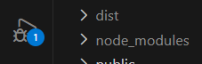

# AAR-compatibility
The application for AAR-compatibility serves as an easy method for checking specifications between certain AAR combinations

## Which software do you need?
For the software to run locally there are couple of softwares you need to install.

1. Make sure you can run the project directory as a whole. For this Visual Studio code is advised: https://code.visualstudio.com/download
2. As the excel to sql read-out is done by a python script, you should install python on your device: https://www.python.org/downloads/
3. Make sure to download the right extensions on Visual Studio Code (python, docker). Search for extensions with Ctrl+Shift+X  
4. This python code needs several libraries. For this open your command prompt (or in Dutch "opdrachtprompt") on your device. First we need to check wether you already have the python library installer.
Type in the command prompt:

```bash
pip --version
```

If you already have pip installed. The output will show something similar to 

```bash 
pip 25.3 from C:\Users\ejwes\AppData\Local\Packages\PythonSoftwareFoundation.Python.3.10_qbz5n2kfra8p0\LocalCache\local-packages\Python310\site-packages\pip (python 3.10)
```

4. In the same command prompt, download the following libraries:
```bash
pip install pandas
pip install sqlalchemy
pip install "psycopg[binary]"
pip install openpyxl
```


5. The software makes use of two services. The first service being postgreSQL and the second service being node.js as the back-end running on javascript. Instead of having to download all the software for these services, we are going to make use of docker.compose. This is a tool for defining and running multi-container applications. It runs all services internally. Download Docker: https://docs.docker.com/ If you have docker installed on your laptop, it might be necessary to download the upper extensions specifically into docker. See [database README](Database/README.md) for more details. 

6. Lastly, you need git bash. This software allows you to communicate between your local and this online repository: https://git-scm.com/install/windows. 

### Now you are all set to work with the necessary software, read "How to work with GITHUB", to see how you can easily clone and adapt the code runnning the software.


## How to work with GITHUB
*Local* refers to the repository on your laptop. *Remote* refers to the repository online on Git.

1.	Make sure to have a github account and download “git bash” for easy usage via https://git-scm.com/install/windows
2.	In the bash terminal type:

```bash
git clone https://github.com/evajw/AAR-compatibility.git
```

3.	Make sure you are working in the right local folder by typing:
```bash
cd “path/to/your/local/folder”
```
4.	To update your local repository type
```bash
git pull origin main
```
5.	To update the remote repository type
```bash
git add .
```
This adds all files in a so called staging phase, you can also change the “.” for a specific file e.g. “git add backend/server/server.js”. 


```bash
git commit -m “Description of your changes”
```
By commiting your changes your create a snapshot of your changes in the staging phase. This is where a new version of your local repository is created. Everything you have added to your add, will now end up in the commit. Make sure to give a description of your changes, as to make clear what adaptions have been done. 

```bash
git pull origin main –-rebase
```
By pulling the remote repository you get the latest version from GIT. BY using -rebase you build your local repository on the newest version of the remote repository. This will show all possible conflicts

```bash
git push origin main
```
Now you can push your commit definitly to GIT. You can also change the directory "main" for another bash. This way you allow people to first check your work before you overwrite everything! 

# Branches
GIT works with branches. This allows the developer to work on different items in the application without having to "break" the already working functionalities. If you want to add something new it is **obligatory** to create a new branch. There might already be branches in your remote repository. To fetch all branches use the command:

```bash
git fetch
```

To create a new branch use the command:
```bash
git branch 'your_new_branch_name'
```

To switch between branches you can use the command:
```bash
git checkout 'your_branch_name'
```

Switching branches is not always possible. If you have been changing inputs in a certain branch, you might first need to commit your changes as explained above. Only after the remote and the local repositroy being are up-to-date with each other, will it be possible to switch branches. There are loopholes around this, but for safety measurements it is best not to do so, or you might loose track of your files. If you feel confident enough with GIT, feel free to explore the internet on how to accomplish this!


## Run the services

Now you are ready use the repository! Here are the steps you need to follow to start the stack and automatically open the frontend in your browser.

1. Open the docker.desktop application on your device.
2. Open Visual Studio Code and in the left top corner of your screen open the folder with the git repository in it.
3. In a terminal at the project root run: `.\start-app.cmd` (or `.\start-app.ps1`).
4. This starts Docker Compose and opens `http://localhost:5173` automatically when the frontend is up.

You can still start manually with `docker compose up -d --build`, but that command does not open your host browser automatically. If you only want to start containers without opening a browser, use `.\start-app.ps1 -NoOpen`.

If you want to run the frontend outside Docker:
1. In your terminal in VSC go to the relevant folder: `cd .\frontend-AAR\`.
2. In your terminal in VSC run: `npm install`.
3. Lastly, in your terminal in VSC run: `npm run dev`. Vite opens the localhost URL automatically.


## Database

See [database README](Database/README.md) for source-data details.

### Python import file

To get [`Database/AAR_excel_to_sql.py`](/d:/Visual%20studio%20code/AAR-compatibility/Database/AAR_excel_to_sql.py) working correctly, the following turned out to be necessary:

1. The Excel source file must be present as `Database/AAR_matrix_2.xlsx`.
2. The workbook must contain the sheets `Tankers`, `Receivers`, and `Specifications`, because the script now reads by sheet name instead of sheet order.
3. A PostgreSQL database must be running on `localhost:5432` with database name `aar_comp_2`, because that connection string is hardcoded in the script.
4. Text fields such as nation, type, and model have to be stripped of leading/trailing spaces before importing, otherwise identical rows are treated as different values.
5. Duplicate rows in `Specifications` have to be removed per tanker/receiver combination; the script keeps the last occurrence and prints a warning when duplicates are found.
6. The tanker and receiver master tables have to be built from both the dedicated sheets and the combinations found in `Specifications`, so missing aircraft are still inserted before the compatibility/specification import runs.
7. The compatibility table should only be filled with combinations that actually exist in `Specifications`. A full cross join between all tankers and receivers produced incorrect compatibility rows.

Run the import from the project root with:

```bash
python .\Database\AAR_excel_to_sql.py
```

If the script fails, first check whether the Excel file path, sheet names, Python packages, and local PostgreSQL connection all match the points above.

### Reset, rebuild, and reload the database

Use the following steps when you want a clean local database rebuild:

1. Stop the stack and remove the PostgreSQL volume:

```bash
docker compose down -v
```

2. Start the services again:

```bash
docker compose up -d --build
```

3. Wait until PostgreSQL is running on `localhost:5432`.
4. Reload the Excel data into the database:

```bash
python .\Database\AAR_excel_to_sql.py
```

Use these steps when you only want to reload the data without deleting the whole database:

```bash
python .\Database\AAR_excel_to_sql.py
```

The import script truncates `tankers`, `receivers`, and `compatibility`, then inserts the current Excel data again. Use `docker compose down -v` only when you want to remove the full local PostgreSQL data volume and rebuild from scratch.


# Front-end

## Front-end
1. Open a terminal in `d:\Visual studio code\AAR-compatibility`.
2. For Docker + auto-open use: `.\start-app.cmd`
3. For frontend-only dev use: `cd frontend-AAR`, `npm install`, `npm run dev`
4. Otherwise you can click on play button in VSC 
5. If it still does not open automatically: copy the `Local:` URL from the terminal and open it manually.

# For login to work with jwt

Install: npm i pg dotenv jsonwebtoken bcryptjs

# Login credantials
Admin:
Username: admin@japcc.com
Password: 12345

SrdHolder:
Username: mike@mindef.nl
Password: Mike1234

Viewer:
Username: viewer@japcc.com
Password: 12345


